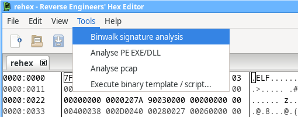
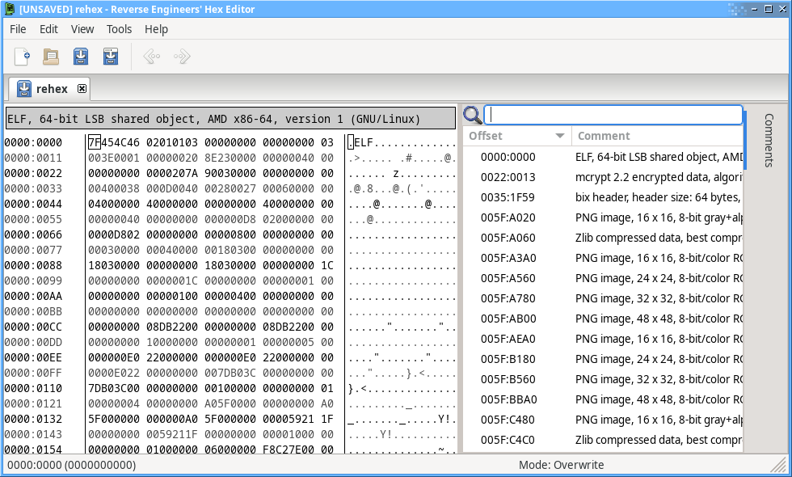

# Binwalk plugin for REHex

This is a plugin for REHex that allows using [Binwalk](https://github.com/ReFirmLabs/binwalk)'s signature analysis on a file within the editor.

## Usage

Once the plugin is installed, a *Binwalk signature analysis* command will be added to the *Tools* menu:

which will add any signatures discovered in the file by Binwalk as comments:

## Installation

If you already have my package repository set up on Debian, Ubuntu or Fedora as described in the main [REHex README](https://github.com/solemnwarning/rehex#installation), then the plugin and dependencies can be installed via your package manager, e.g:

    $ sudo apt-get install rehex-plugin-binwalk
    OR
    $ sudo dnf install rehex-plugin-binwalk

On other platforms, simply download `binwalk.lua` and place it in the REHex [plugin directory](https://solemnwarning.net/rehex/manual/plugins.html). You will have to install Python and Binwalk separately.
